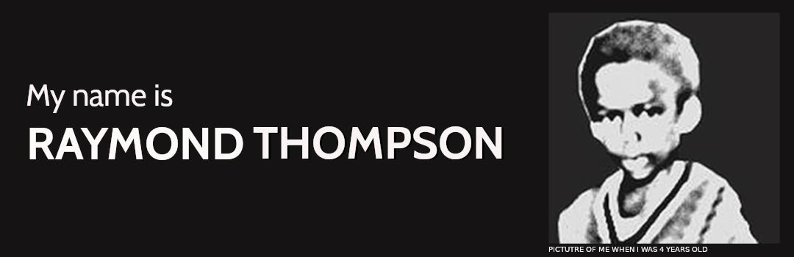

### Hi there 👋🏾 

<!--
**raythompsonwebdev/raythompsonwebdev** is a ✨ _special_ ✨ repository because its `README.md` (this file) appears on your GitHub profile.

Here are some ideas to get you started:

- 🔭 I’m currently working on ...
- 🌱 I’m currently learning ...
- 👯 I’m looking to collaborate on ...
- 🤔 I’m looking for help with ...
- 💬 Ask me about ...
- 📫 How to reach me: ...
- 😄 Pronouns: ...
- ⚡ Fun fact: ...
-->

### I love to code and create websites and web applications. 😄

* I can design, construct and deploy websites and web applications that follow the latest web standards and best practices, are performant, secure and can be viewed on most browsers and mobile devices.

* My coding languages of choice are Javascript, PHP, MySQL along with HTML CSS. :keyboard: 

* I like to dabble with WordPress Themes and plugins, React, VueJS and Gatsby applications. :desktop_computer: :iphone:

Checkout my website : 
[raythompsonwebdev.co.uk](https://raythompsonwebdev.co.uk)

📫 How to reach me: ...

- [LinkedIn](https://raythompsonwebdev.co.uk)
- [Discord](https://raythompsonwebdev.co.uk)
- [Twitter](https://raythompsonwebdev.co.uk)

